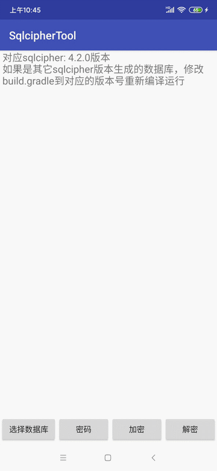

### SqlcipherTool

加密或解密通过[sqlcipher](https://github.com/sqlcipher/sqlcipher)创建的数据库。需要使用对应生成数据库[sqlcipher](https://github.com/sqlcipher/sqlcipher)版本。


### 如何使用

修改build.gradle中所使用的sqlcipher版本，重新编译运行即可

当前使用的是sqlcipher:4.2.0

```
SqlcipherDbUtil dbUtil = new SqlcipherDbUtil();
int ret = dbUtil.decipherDb(MainActivity.this, password, dealDbPath);
if (ret == SqlcipherDbUtil.SUCCESS){
	// 解密成功，在原路径生成一个加上_decipher后缀的数据库文件
}

/*对未加密的数据库加密*/
ret = dbUtil.encryptDb(MainActivity.this, password, dealDbPath);
if (ret == SqlcipherDbUtil.SUCCESS){
	// 加密成功，在原路径生成一个加上_encrypt后缀的数据库文件
}
```

### 运行


